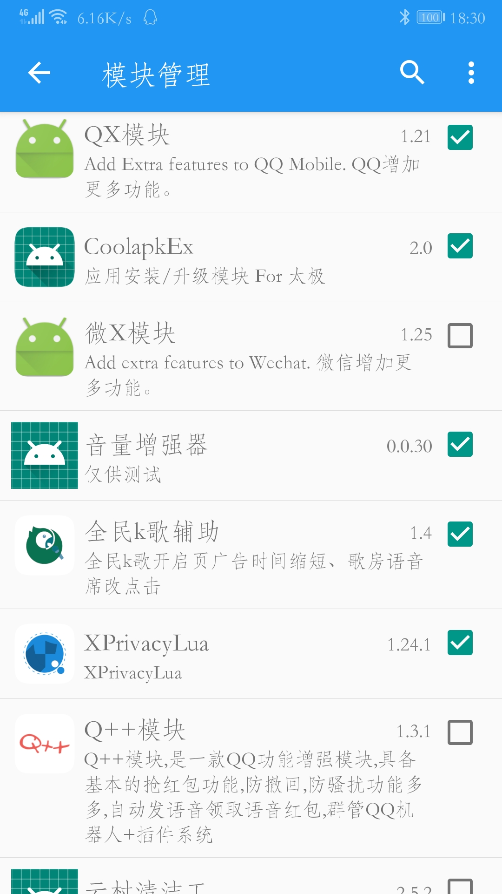
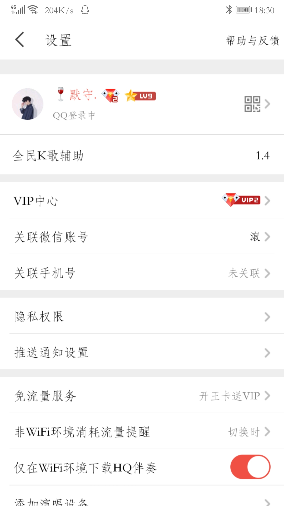
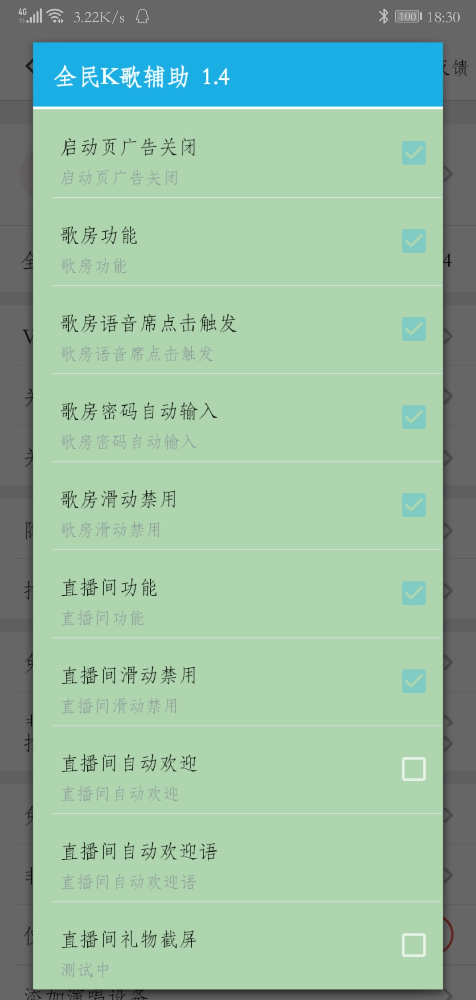
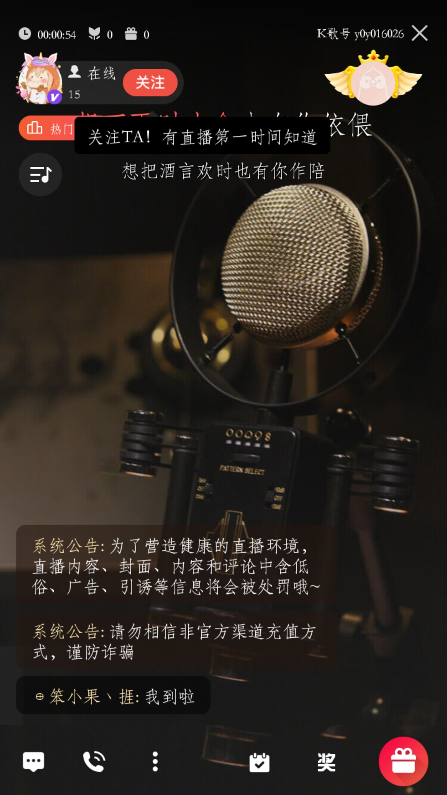

1.在Xposed或者太极模块页中勾选启用“全民K歌辅助”，Xposed需要勾选后重启手机

2.打开全名K歌，在设置中有本模块设置

3.启动全名K歌时，出现广告，会快速跳过

4.歌房中  上下滑动切换歌房会被禁用，歌房密码自动输入：会在点第一次确定以后自动输入密码进行解锁，单麦歌房语音席 点击开启语音功能

5.直播间中  上下滑动切换直播间会被禁用，直播间有自动欢迎每一位进入直播间用户（仅限一等布衣以上有提醒者），直播间礼物达到一定k币值自动截屏。
